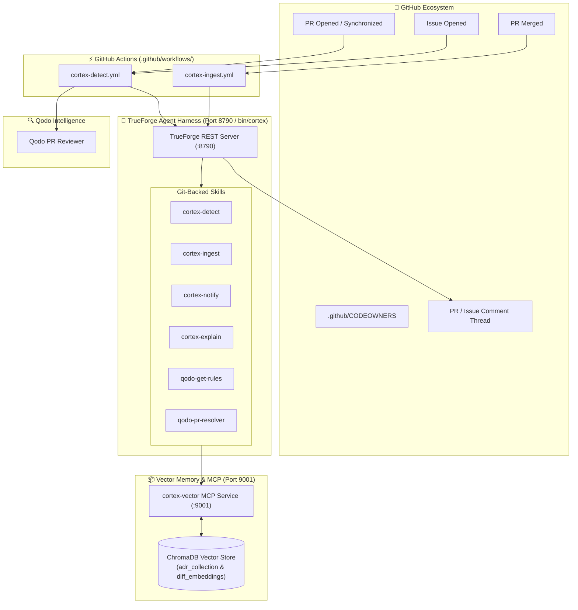

# 🧠 Codebase Cortex

> **An AI-powered agent harness built with TrueForge & Qodo that captures institutional memory, enforces architectural invariants in GitHub PRs & Issues, and alerts maintainers when foundational decisions are challenged.**

[](https://truefoundry.com)
[](https://github.com/truefoundry/trueforge)
[](https://qodo.ai)
[](LICENSE)

---

## 🎯 The Problem

1. **AI tools tell you *what* code does, but nobody tells you *why* it was written that way.**
2. When senior engineers or maintainers step away, institutional memory — the trade-offs, benchmarks, and historical rationale behind foundational decisions — leaves with them.
3. New contributors or team members submit pull requests or open proposals (e.g., replacing Redis with an in-process dictionary) unaware of critical architectural invariants (e.g., Kubernetes pod resilience, connection pool limits under 10k active sessions).
4. Maintainers are left manually reviewing diffs to catch subtle architectural drift before code reaches production.

---

## 💡 The Solution

**Codebase Cortex** acts as the automated architectural guard and institutional memory for your repository:

- **📜 Ingests Architecture Decision Records (ADRs):** Automatically captures merged architectural decisions and indexes them into ChromaDB vector memory.
- **🛡️ Two-Stage Contradiction Detection:** Audits incoming PR diffs and Issue proposals against active ADR invariants using dense semantic retrieval and cross-encoder verification.
- **🔔 Maintainer Escalation:** Resolves repository `CODEOWNERS` and original decision authors to automatically page maintainers on GitHub when foundational architecture is challenged.
- **🔍 Qodo Code Quality Integration:** Works alongside Qodo code reviews to enforce both code quality and architectural integrity.
- **💬 Natural Language Q&A:** Allows developers to query historical reasoning (*"Why did we choose Redis over Postgres?"*) directly via CLI or Web Dashboard.

---

## 🏗️ System Architecture



---

## 🚀 Quickstart: Running Locally

Follow these steps to run Codebase Cortex on your local machine.

### Prerequisites

- **Node.js:** v18.x or higher (for `bin/cortex` CLI and `@truefoundry/trueforge`)
- **Python:** 3.10, 3.11, or 3.12
- **Git**
- **LLM API Key:** At least one of `ANTHROPIC_API_KEY`, `OPENAI_API_KEY`, or `GEMINI_API_KEY` / `GOOGLE_API_KEY`

---

### Step 1: Clone Repository & Configure Environment

```bash
git clone https://github.com/thisisvaishnav/codebase-cortex.git
cd codebase-cortex

# Copy example environment file
cp .env.example .env
```

Open `.env` in your text editor and set your credentials:

```bash
export GITHUB_REPOSITORY="thisisvaishnav/codebase-cortex"
export GITHUB_TOKEN="ghp_your_github_personal_access_token"
export ANTHROPIC_API_KEY="sk-ant-..." # or OPENAI_API_KEY / GEMINI_API_KEY
```

---

### Step 2: Install Python Dependencies

```bash
# Install root project dependencies
python -m pip install -r requirements.txt

# Install vector MCP server dependencies
python -m pip install -r cortex-vector-mcp/requirements.txt
```

---

### Step 3: Start Vector Memory Service (Port 9001)

In terminal window #1, start the `cortex-vector` MCP service and seed existing ADRs into vector memory:

```bash
# 1. Seed existing ADRs into ChromaDB
python -m cortex_vector_mcp.indexer --adr-dir docs/adr --persist-dir ./chromadb_data
python -m cortex_vector_mcp.indexer --adr-dir docs --persist-dir ./chromadb_data

# 2. Start the FastMCP server on port 9001
CORTEX_CHROMA_DIR=./chromadb_data python -m uvicorn cortex_vector_mcp.server:app --host 127.0.0.1 --port 9001
```

---

### Step 4: Start TrueForge Agent Server (Port 8790)

In terminal window #2, launch the TrueForge server:

```bash
npx --yes @truefoundry/trueforge@0.1.4 --port 8790
```

---

### Step 5: Provision Agent & Verify Health

In terminal window #3, use the `./bin/cortex` wrapper to provision skills, MCP connectors, and verify system readiness:

```bash
# Register model providers, MCP connectors, and skills with TrueForge
./bin/cortex setup

# Check server and configuration health
./bin/cortex doctor
```

Output should show:
```text
TrueForge URL   http://localhost:8790
server          reachable
models          anthropic/claude-sonnet-5, ...
mcp servers     github, cortex-vector
skills          cortex-detect, cortex-ingest, cortex-notify, cortex-explain, qodo-get-rules, qodo-pr-resolver
agents          codebase-cortex
```

---

## 🛠️ CLI Usage Examples

### 1. Query Institutional Memory (Natural Language)

Ask why a specific decision was made:

```bash
./bin/cortex explain --question "Why did we choose Redis over PostgreSQL for session caching?"
```

### 2. Pre-flight Issue Scan

Scan an Issue proposal for potential architectural conflicts before code is written:

```bash
./bin/cortex detect --issue 45
```

### 3. PR Violation Audit

Audit an open Pull Request diff against stored ADR invariants:

```bash
./bin/cortex detect --pr 5
```

### 4. Capture Merged ADR

Ingest a merged PR into vector memory and auto-generate an ADR markdown file:

```bash
./bin/cortex ingest --pr 89 --author senior-dev
```

---

## 💻 Web Dashboard & Lineage Visualizer

Codebase Cortex includes a standalone web dashboard for exploring decision lineage and querying memory visually.

To open the dashboard:

```bash
# Open standalone HTML dashboard in your browser
open dashboard.html
```

Or run the React + Vite dashboard UI:

```bash
cd dashboard-ui
npm install
npm run dev
```

Navigate to `http://localhost:5173` to query ADR memory and inspect live decision timelines.

---

## 📂 Project Structure

```text
codebase-cortex/
├── .github/
│   ├── CODEOWNERS                  # Maintainer ownership mapping
│   ├── pull_request_template.md    # PR template with ADR capture header
│   └── workflows/
│       ├── cortex-detect.yml       # CI workflow for PR diff & Issue audits
│       └── cortex-ingest.yml       # CI workflow for merged ADR capture
├── bin/
│   └── cortex                      # REST wrapper CLI for TrueForge server
├── cortex-vector-mcp/
│   ├── cortex_vector_mcp/
│   │   ├── indexer.py              # Cold-start ADR markdown indexer
│   │   ├── schema.py               # ADR dataclass & validation rules
│   │   ├── server.py               # FastMCP server (port 9001)
│   │   └── store.py                # ChromaDB vector store + TF-IDF fallback
│   └── requirements.txt
├── docs/
│   ├── ADR-001-codebase-cortex.md  # Primary project ADR
│   ├── ARCHITECTURE.md             # Detailed technical architecture doc
│   ├── TRUEFORGE-API-FINDINGS.md   # TrueForge REST API integration findings
│   └── adr/
│       ├── ADR-002-distributed-cache-redis.md
│       └── ADR-003-event-driven-architecture.md
├── skills/                         # Git-backed agent skills
│   ├── cortex-detect/
│   ├── cortex-explain/
│   ├── cortex-ingest/
│   ├── cortex-notify/
│   ├── qodo-get-rules/
│   └── qodo-pr-resolver/
├── src/                            # Monitored codebase package
│   └── cache/
│       ├── __init__.py
│       └── session.py              # Redis session persistence implementation
├── dashboard.html                  # Standalone Q&A & Lineage HTML UI
├── dashboard-ui/                   # React + Vite dashboard app
├── agent.json                      # TrueForge AgentSpec manifest
└── requirements.txt
```

---

## 🏆 Hackathon Track Alignment

- **Best Use of TrueForge:** Full orchestration of TrueForge v0.1.4 REST server, remote MCP connectors (`github`, `cortex-vector`), git-backed skills, and dynamic session turns.
- **Best Code Quality:** Integrated with Qodo for automated PR code reviews, repo standards checking, and self-healing error resolution loops.
- **Best UI & UX:** Features both a CLI wrapper (`bin/cortex`) and an interactive React/HTML dashboard for decision lineage visualization.

---

## 📄 License

Distributed under the MIT License. See `LICENSE` for details.
