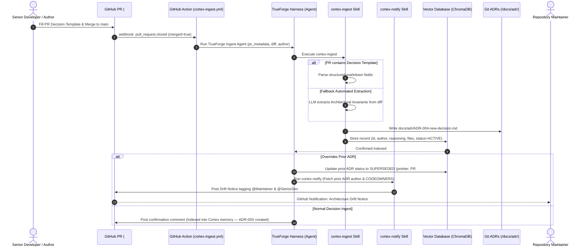
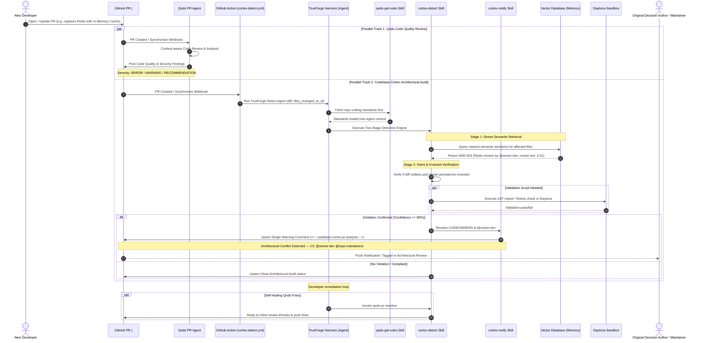
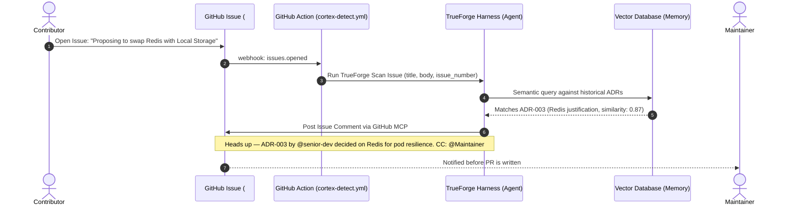
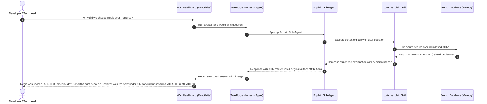
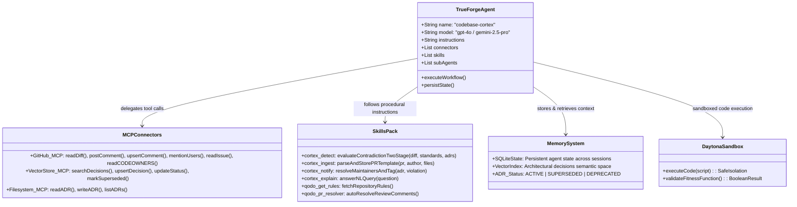

# 🏛️ Codebase Cortex — Complete System Architecture

> **A TrueForge-powered agent harness capturing institutional architectural memory, enforcing architectural integrity alongside Qodo in GitHub PRs, and alerting maintainers when foundational architecture is challenged.**

---

## 1. High-Level Architecture Overview

Codebase Cortex bridges developer changes with institutional memory. It monitors PRs and Issues, compares diffs against vector-stored architectural decisions, runs Qodo code reviews, and automatically mentions/escalates to maintainers and original decision authors when foundational architecture is impacted.

```mermaid
flowchart TB
    subgraph GitHub_Ecosystem ["🐙 GitHub Repository & Events"]
        PR_Event["PR Opened / Synchronize"]
        Merge_Event["PR Merged to main"]
        Issue_Event["Issue Opened"]
        CODEOWNERS[".github/CODEOWNERS"]
        PR_Thread["PR / Issue Discussion Thread"]
    end

    subgraph Qodo_Intelligence ["🔍 Qodo Intelligence Layer (Hero #2)"]
        Qodo_Bot["Qodo PR Reviewer (/agentic_review)"]
        Qodo_Rules["Qodo Repo Standards & Rules"]
        Qodo_Resolver["qodo-pr-resolver Skill (Self-Healing)"]
    end

    subgraph CI_Execution ["⚡ GitHub Actions Pipeline"]
        Action_Detect["cortex-detect.yml\n(Headless TF Agent Runner)"]
        Action_Ingest["cortex-ingest.yml\n(Headless TF Agent Runner)"]
    end

    subgraph TrueForge_Harness ["🧠 TrueForge Agent Harness (Hero #1 — Port 8790 / CLI)"]
        TF_Core["agent.json: codebase-cortex"]
        
        subgraph SubAgents ["Dynamic Sub-Agents"]
            Agent_Detect["Detection & Audit Agent"]
            Agent_Ingest["Ingest & Memory Agent"]
            Agent_Notify["Escalation & Router Agent"]
            Agent_Explain["NL Explanation Agent"]
        end

        subgraph Skills_Pack ["Git-Backed Skills (SKILL.md)"]
            Skill_Detect["cortex-detect\n(Two-Stage Evaluator)"]
            Skill_Ingest["cortex-ingest\n(Hybrid Template+Diff Extractor)"]
            Skill_Notify["cortex-notify\n(CODEOWNERS + Author Router)"]
            Skill_Explain["cortex-explain\n(Institutional Q&A)"]
            Skill_QodoRules["qodo-get-rules\n(Fetch Team Standards)"]
            Skill_QodoResolver["qodo-pr-resolver\n(Auto-fix Quality Issues)"]
        end

        subgraph MCP_Layer ["Model Context Protocol (MCP) Connectors"]
            MCP_GH["GitHub MCP\n(PRs, Comments, Issues, Commits)"]
            MCP_VDB["Vector Store MCP\n(ChromaDB / Qdrant)"]
            MCP_FS["Filesystem MCP\n(docs/adr/ Git Sync)"]
        end

        subgraph Sandbox_Layer ["🛡️ Daytona Sandbox"]
            Daytona["Isolated Execution Env\n(AST & Architectural Fitness Tests)"]
        end
    end

    subgraph Knowledge_Base ["💾 Unified Knowledge & Memory Store"]
        Chroma[("Vector DB (ChromaDB)\n- adr_collection (Active/Superseded)\n- diff_embeddings")]
        Git_ADRs[("Git ADR Directory\n/docs/adr/ADR-XXX.md")]
        SQLite_State[("SQLite Session State\n(TrueForge Persistent Context)")]
    end

    subgraph Frontend_App ["🖥️ Web Dashboard (React + Tailwind)"]
        Dash_Timeline["ADR Visual Timeline & Lineage Graph"]
        Dash_Violations["Live Maintainer Violation Feed"]
        Dash_QA["NL Query Interface ('Why did we pick Redis?')"]
        Dash_Drift["Architecture Drift & Deprecation Monitor"]
    end

    %% Event Triggers
    PR_Event --> Qodo_Bot
    PR_Event --> Action_Detect
    Merge_Event --> Action_Ingest
    Issue_Event --> Action_Detect

    %% Action to TrueForge Execution
    Action_Detect --> TF_Core
    Action_Ingest --> TF_Core

    %% Agent Dispatch
    TF_Core --> Agent_Detect
    TF_Core --> Agent_Ingest
    TF_Core --> Agent_Notify
    TF_Core --> Agent_Explain

    %% Detect Flow
    Agent_Detect --> Skill_QodoRules
    Skill_QodoRules -.-> Qodo_Rules
    Agent_Detect --> Skill_Detect
    Skill_Detect --> MCP_VDB
    MCP_VDB <--> Chroma
    Skill_Detect -.-> Daytona
    Skill_Detect --> Agent_Notify
    Agent_Notify --> Skill_Notify
    Skill_Notify --> CODEOWNERS
    Skill_Notify --> MCP_GH
    MCP_GH --> PR_Thread

    %% Ingest Flow
    Agent_Ingest --> Skill_Ingest
    Skill_Ingest --> MCP_FS
    MCP_FS --> Git_ADRs
    Skill_Ingest --> MCP_VDB
    Skill_Ingest --> Agent_Notify

    %% Qodo Flow
    Qodo_Bot --> PR_Thread
    Agent_Detect -.-> Skill_QodoResolver
    Skill_QodoResolver -.-> Qodo_Bot

    %% UI Flow
    Chroma <--> Dash_Timeline
    Chroma <--> Dash_Drift
    SQLite_State <--> Dash_Violations
    Dash_QA --> Agent_Explain
    Agent_Explain --> Skill_Explain
    Skill_Explain --> MCP_VDB
```

---

## 2. Sequence Diagram: Flow 1 — Knowledge Ingestion & Drift Alert on PR Merge

---

## 3. Sequence Diagram: Flow 2 — PR Contradiction Detection & Maintainer Alert

---

## 4. Sequence Diagram: Flow 3 — Pre-flight Issue Scanning

---

## 5. Sequence Diagram: Flow 4 — Natural Language Query via Dashboard

---

## 6. TrueForge Harness Configuration (`agent.json` Architecture)

---

## 7. Execution Modes: CI Runner vs. Local Daemon

Codebase Cortex supports two execution topologies:

1. **Headless CI Runner Mode (GitHub Actions):**
   - Workflow executes `npx @truefoundry/trueforge run agent.json --input "..."`.
   - Runs deterministically in the ephemeral GitHub runner.
   - Accesses repo secrets (`TF_API_KEY`, `GITHUB_TOKEN`).
   - Idempotent and zero-server dependency.

2. **Interactive Daemon Mode (Local / Dashboard):**
   - TrueForge server runs on `http://localhost:8790`.
   - Web Dashboard communicates via REST / SSE streaming.
   - Perfect for live interactive queries and visual exploration during development and live demos.

---

## 8. Two-Stage Detection Engine & Confidence Calibration

| Stage | Mechanism | Purpose |
|---|---|---|
| **Stage 1: Retrieval** | Dense Bi-Encoder Embedding Search (Cosine Similarity $\ge 0.70$) | Retrieve top-5 candidate ADRs whose scope intersects modified files and concepts. |
| **Stage 2: Intent Evaluation** | LLM Cross-Encoder Evaluation via `cortex-detect` skill | Analyze semantic intent: does the diff break the invariant or simply refactor cleanly? |

### Confidence & Action Matrix

| Score Range | Classification | Action |
|---|---|---|
| **High ($\ge 80\%$)** | **Hard Violation** | Post violation comment + escalate to original author & CODEOWNERS |
| **Medium ($60\% - 79\%$)** | **Advisory Notice** | Post advisory note: "Possible architectural intersection, verify ADR alignment" |
| **Low ($< 60\%$)** | **Compliant / Orthogonal** | Silent pass or green audit badge |

---

## 9. Technology Stack & Role Matrix

| Layer | Component | Choice | Reason & Superpower |
|---|---|---|---|
| **Runtime Harness** | Agent OS | **TrueForge** (`@truefoundry/trueforge`) | Complete harness with MCP, persistent SQLite memory, subagents & skills |
| **Code Intelligence** | Code Review & Standards | **Qodo** | Repo-wide semantic comprehension, `qodo-get-rules` & `qodo-pr-resolver` skills |
| **Automation** | Event Triggers | **GitHub Actions** | Zero-latency event pipeline for `pull_request` & `issues` |
| **Maintainer Routing** | Notification Engine | `cortex-notify` Skill | Tags original decision author and CODEOWNERS on violation/drift with deduplication |
| **Memory / RAG** | Vector Database | **ChromaDB / Qdrant** | High-speed semantic similarity matching over code & reasoning |
| **Session State** | Persistent State | **SQLite** (TrueForge built-in) | Agent carries context across sessions without external infra |
| **Sandboxing** | Code Execution | **Daytona** | Safe isolated environment for optional AST/fitness validation scripts |
| **Integrations** | Protocols | **Model Context Protocol (MCP)** | Native, standard tool invocation for GitHub, Storage & Filesystem |
| **NL Query** | Explanation Engine | `cortex-explain` Skill | Answers "Why did we do X?" against indexed ADR memory |
| **Dashboard** | Frontend UI | **React + Tailwind CSS** | Real-time decision timeline, SUPERSEDED lineage graph, NL search, demo console |

---

## 10. Skills Summary

| Skill | File | Purpose |
|---|---|---|
| `cortex-detect` | `skills/cortex-detect/SKILL.md` | Two-stage diff and issue contradiction detection (Retrieval + LLM Intent Evaluator) |
| `cortex-ingest` | `skills/cortex-ingest/SKILL.md` | Hybrid template & diff extraction, indexing, and git ADR sync |
| `cortex-notify` | `skills/cortex-notify/SKILL.md` | CODEOWNERS resolution, maintainer tagging, and comment deduplication |
| `cortex-explain` | `skills/cortex-explain/SKILL.md` | Natural language explanation of institutional decisions |
| `qodo-get-rules` | `skills/qodo-get-rules/SKILL.md` | Fetches repo standards before analysis (runs first in detect flow) |
| `qodo-pr-resolver` | `skills/qodo-pr-resolver/SKILL.md` | Self-healing loop: resolves Qodo findings, posts commits, replies to inline threads |
